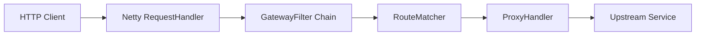

# Netty API Gateway

一个基于 Netty 的轻量级 API 网关。当前版本已经可以作为最小可用网关运行：监听入口端口，根据配置匹配路径前缀，并把请求反向代理到后端服务。

## 当前进度

已完成：

- Netty HTTP 服务启动，默认监听 `8080`
- `GatewayFilter` 责任链
- 请求路径日志过滤器
- `/healthz` 健康检查
- 配置化路由
- HTTP 反向代理转发
- 可执行 fat jar 打包

暂未完成：

- 鉴权
- 限流
- 熔断/重试
- TLS 终止
- 结构化日志和监控指标
- Docker 镜像和云平台部署文件

## 架构



## 路由配置

默认配置文件：

```text
config/gateway.properties
```

示例：

```properties
server.port=8080

routes.0.id=local-api
routes.0.pathPrefix=/api
routes.0.target=http://localhost:9000
routes.0.stripPrefix=true
```

含义：

- 请求 `http://localhost:8080/api/hello`
- 匹配 `/api`
- 去掉 `/api`
- 转发到 `http://localhost:9000/hello`

也可以用启动参数指定配置文件：

```powershell
java -Dgateway.config=D:\path\gateway.properties -jar target\netty-http-server-1.0.0.jar
```

或者使用环境变量：

```powershell
$env:GATEWAY_CONFIG="D:\path\gateway.properties"
java -jar target\netty-http-server-1.0.0.jar
```

## 构建

```powershell
mvn clean package
```

成功后生成：

```text
target/netty-http-server-1.0.0.jar
```

## 运行

```powershell
java -jar target\netty-http-server-1.0.0.jar
```

成功标志：

```text
Netty HTTP server started on port 8080
Health check: http://localhost:8080/healthz
```

## 验证

健康检查：

```powershell
curl http://localhost:8080/healthz
```

成功返回：

```text
OK
```

代理验证：先启动一个后端服务监听 `9000`，再访问：

```powershell
curl http://localhost:8080/api/hello
```

如果后端 `http://localhost:9000/hello` 正常返回，网关会把状态码、响应体和普通响应头转回客户端。

## 过滤器接口

`GatewayFilter` 的核心方法：

```java
void filter(Request request, Response response, Chain chain) throws Exception;
```

继续执行后续过滤器：

```java
chain.next(request, response);
```

如果过滤器已经写出响应，可以不调用 `chain.next(...)`。

## 上线前建议

当前版本已经具备最小可用网关能力。正式生产流量建议继续补：

- Dockerfile 和进程守护配置
- 请求日志改为结构化日志
- 后端超时、重试、熔断策略
- 限流和鉴权过滤器
- Prometheus 指标或其他监控

