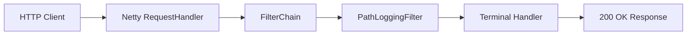

# Netty HTTP Server

一个基于 Netty 的简易 HTTP 服务器示例。当前项目重点是：

- 监听 `8080` 端口
- 打印每次请求的路径
- 使用责任链模式定义并执行 `GatewayFilter`
- 通过 `FilterChain` 统一管理和执行过滤器
- 返回简单的 `200 OK` 文本响应

## 当前架构



## 目录结构

```text
src/main/java/com/example/nettyhttp
├── filter
│   ├── Chain.java
│   ├── FilterChain.java
│   ├── GatewayFilter.java
│   ├── PathLoggingFilter.java
│   ├── Request.java
│   └── Response.java
└── server
    └── NettyHttpServer.java
```

## 运行

确保本机已安装 JDK 17 和 Maven，然后执行：

```powershell
mvn clean package
mvn exec:java
```

访问：

```powershell
curl http://localhost:8080/hello
```

服务端终端会输出：

```text
Request path: /hello
```

客户端会收到：

```text
OK
```

## 过滤器接口

`GatewayFilter` 的核心方法：

```java
void filter(Request request, Response response, Chain chain) throws Exception;
```

自定义过滤器处理完成后，继续执行后续过滤器：

```java
chain.next(request, response);
```

如果过滤器已经写出响应，可以不调用 `chain.next(...)`，后续过滤器和默认处理逻辑就不会继续执行。

## 已实现

- Netty HTTP 服务启动
- `GatewayFilter` 接口
- `FilterChain` 责任链执行
- 请求路径打印过滤器
- 简单文本响应封装

## 暂未实现

- 动态路由转发
- 鉴权
- 限流
- 后端服务代理

